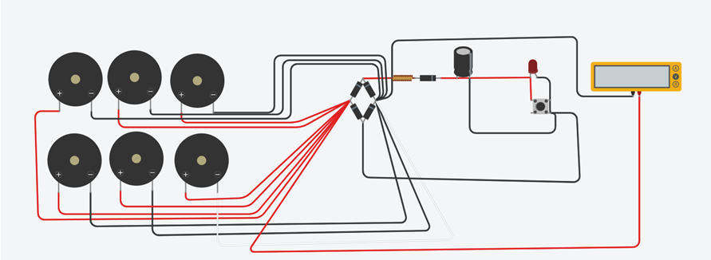
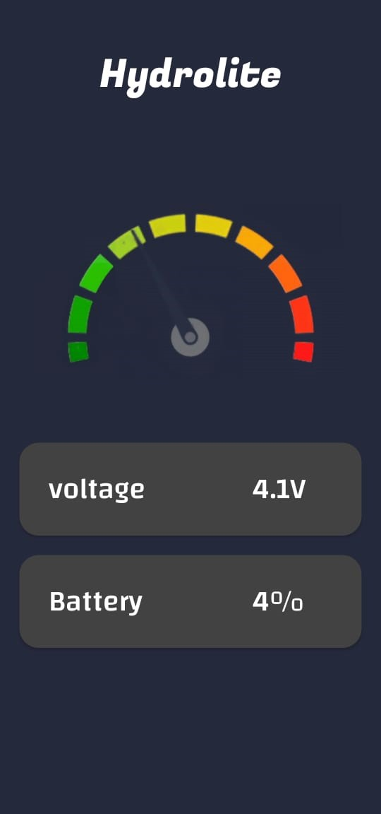

# HydroEnergen - Evergreen energy conversion technique

The Raindrop Energy Conversion System is an innovative solution designed to harness the kinetic energy of rainwater and convert it into electrical energy using piezoelectric transducer technology. This project aims to provide a sustainable, decentralized approach to electricity generation, particularly suited for regions with heavy rainfall and abundant water resources. By leveraging the impact energy of falling raindrops, the system addresses the need for renewable energy sources while reducing reliance on fossil fuels.

### Screenshot

## Architecture Diagram

## Android Application

### Components used
- Piezoelectric plate
- Andoid 
- Diode
- Capacitor
- One-tap button
- LED
- Battery
- LCD Display

## Advantage

- **Renewable Energy Source:** Utilizes the abundant energy of rainwater, reducing reliance on fossil fuels.
- **Low Environmental Impact:** Generates clean electricity without greenhouse gas emissions or habitat disruption.
- **Scalability:** Modular design allows for flexible deployment to meet varying energy demands.
- **Accessibility:** Can be deployed in diverse geographic locations, providing electricity to communities with limited access to traditional energy infrastructure.
- **Reliability:** Robust construction ensures durability in harsh environmental conditions.
- **Cost-Effective:** Offers a cost-effective alternative to traditional energy sources, with lower capital costs and reduced dependence on fossil fuels.

## Author

- Website - [SABARI VADIVELAN](https://in.linkedin.com/in/sabari-vadivelan-s-637667258)
- Website - [UVARAJAN_D](www.linkedin.com/in/uvarajan-dev)

## Contact Developer

- Discord - [SABARI VADIVELAN]()
- Discord - [UVARAJAN]() 